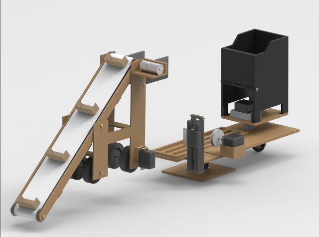
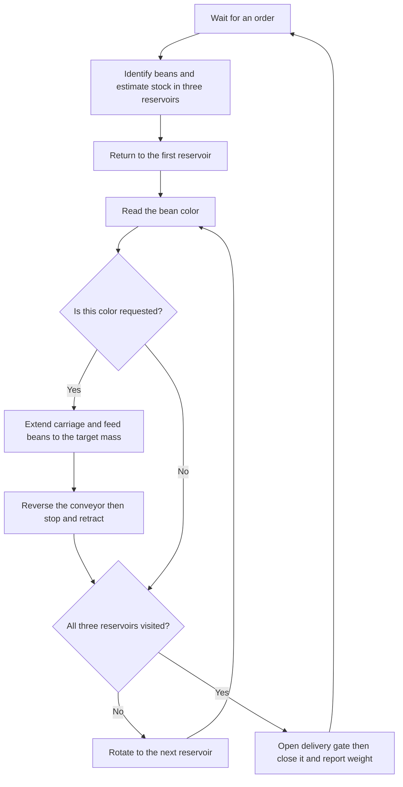
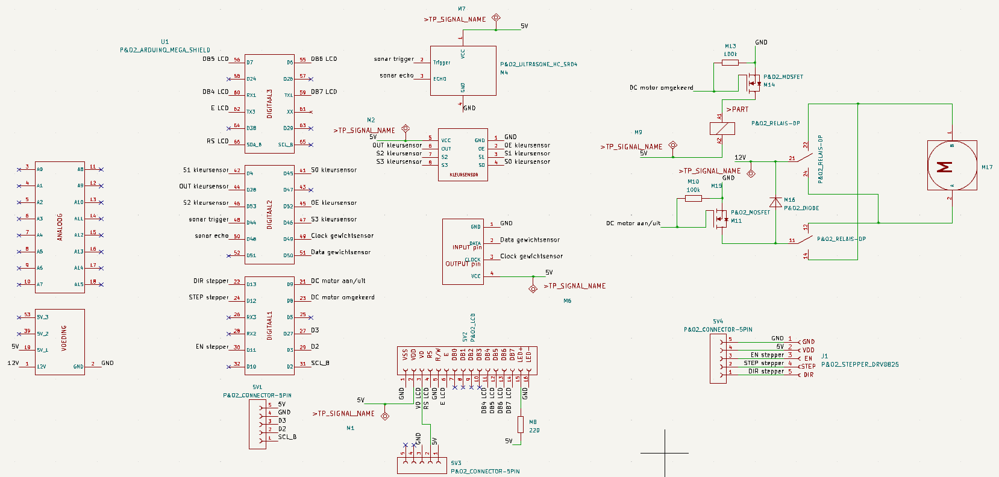
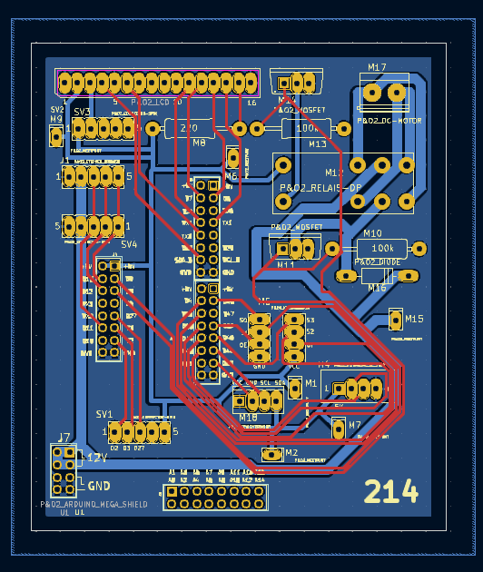

# BeanBot

BeanBot is an automatic bean dispenser built around an Arduino Mega 2560. It takes an order for white, black and red beans, collects the requested mass of each color and delivers the mixture into a reusable container. The project combines a rotating rail, a sliding scoop conveyor and a weighing container with sensors that identify the beans and estimate the stock left in the reservoirs.

This repository contains the Arduino firmware for the assembled machine. The Mega runs the mechanisms through the BeanBot PCB and receives orders through an ESP32 WiFi bridge. The firmware follows the physical sequence of inspecting the reservoirs, collecting beans and opening the delivery gate.



*Assembly rendering of BeanBot. The conveyor carries beans up to the weighing container. The rotating rail selects a reservoir while the sliding carriage moves the conveyor into reach of the beans.*

## From an order to a filled container

An order specifies a mass for each bean color. BeanBot first visits all three reservoirs to find out which color is stored in each one and estimate how much is available. The color sensor identifies the beans. The frame then moves slightly to align a descending ultrasound probe with the reservoir. As the probe lowers, a shorter distance than its initial view of the rear wall indicates the bean surface. The software uses the modeled probe travel and reservoir geometry to estimate the stock in grams.

Once the scan is complete, the mechanism returns to the first reservoir and starts collecting. It reads the color again, checks whether that color was requested and extends the carriage if beans are needed. The conveyor lifts beans into the weighing container until the scale registers the requested increase in mass. All colors accumulate in the same container, so the software keeps the previous collected weight as the baseline for the next color.

Before moving on, the conveyor reverses for ten seconds to return excess beans still on the belt. It then stops and the carriage retracts. After visiting all three reservoirs, BeanBot moves to the delivery position, opens the gate and allows the mixture to fall into the user's container. It closes the gate, reports the collected weight and waits for another order.



The LCD shows approximate remaining stock by color. After collection, the measured mass is deducted from that color's estimate, with the result bounded at zero. This updates the display without performing another probe scan. The scale determines when to stop collecting; the stock estimate does not limit or reject an order.

## The hardware behind the sequence

The rail and carriage provide two different movements. A stepper motor rotates the rail between the reservoirs and the delivery position. A servo moves the carriage along the rail to bring the conveyor into the beans. The conveyor itself uses a DC motor, with switching circuitry to run it forward or in reverse. Two further servos operate the delivery gate and the distance probe.

| Part | Role in BeanBot |
| --- | --- |
| Arduino Mega 2560 | Runs the application and connects to the control PCB |
| ESP32 serial bridge | Passes WiFi orders to the Mega and carries weight messages back |
| Stepper motor with DRV8825 | Positions the rotating rail using step and direction signals |
| DC conveyor motor | Scoops up beans and returns excess beans when reversed |
| PCA9685 servo controller | Generates the PWM signals for the carriage, gate and probe |
| Load cell with HX711 | Measures the mass accumulated in the weighing container |
| TCS3200 color sensor | Identifies white, black and red beans |
| HC-SR04 ultrasound sensor | Detects the bean surface during the probe scan |
| 16-by-2 character LCD | Displays the estimated stock |

The PCB brings the control signals and actuator connections together. On the original assembled BeanBot, the firmware uses the pin configuration tested with its individual hardware components. Those assignments are collected in [Config.h](src/beanbot/Config.h), together with servo positions, frame step counts and sensor calibration values. Servo connector numbers refer to the PCB connections; the code translates these into PCA9685 channels.



*Electrical schematic showing the controller connections, sensor interfaces and motor circuitry. Open the image to inspect the labels at full resolution.*



*PCB routing and connector placement for the assembled controller.*

## Uploading and using BeanBot

The intended setup is the physical BeanBot with its PCB, an Arduino Mega 2560 and the Arduino IDE. Keep the complete project together: the small sketch depends on the source files beneath `src/`.

1. **Prepare the machine.** Connect the mechanisms and sensors through the BeanBot PCB in the tested configuration. Use the machine's actuator power supply as well as the USB connection needed for programming. Empty the weighing container, retract the carriage, close the gate and raise the probe. Put the rotating frame in its normal starting position before running the sketch.
2. **Open the sketch.** Keep the project folder named `BeanBot` and open [BeanBot.ino](BeanBot.ino) in the Arduino IDE. Keep `src/` inside that folder so the IDE compiles the application and its libraries with the sketch.
3. **Select the board.** Install **Arduino AVR Boards** through Boards Manager if needed. Select **Arduino Mega or Mega 2560**, choose **ATmega2560** if a processor selection is shown and select the USB port connected to the Mega.
4. **Verify and upload.** Use the IDE's **Verify** button to compile the sketch, then **Upload** to program the board. The Arduino starts the program after upload. Its startup sequence initializes the hardware and tares the scale, so the weighing container must remain empty during startup.
5. **Place an order.** With the default WiFi configuration, leave the existing ESP32 bridge connected and use the project's ordering interface to send an order. Put the receiving container at the delivery position. BeanBot then scans, collects and delivers automatically.

There is no automatic homing routine: startup does not find the frame position or move every servo to its starting position. The initial physical arrangement matters because subsequent movements are relative. After an interrupted cycle, restore that arrangement before restarting. Remove delivered beans from the receiving area as needed and keep the weighing container empty between orders.

The required Adafruit PWM Servo Driver **2.4.1**, bogde HX711 **0.7.5** and LiquidCrystal **1.0.7** sources are already included under `src/vendor/`. They do not need separate Library Manager installations. The board package supplies the Arduino core and Wire. Library versions and license notices are documented in the [dependency README](src/vendor/README.md).

### Running through the Serial Monitor

The normal configuration is `Config::Communication::useWifi = true`. Uploading this sketch programs the Mega; it does not install or configure the ESP32 firmware or the phone interface. Those must already be available for the WiFi workflow.

For a local run without the WiFi ordering interface, set `useWifi` to `false` in [Config.h](src/beanbot/Config.h) and upload again. **This mode starts a demo order automatically after boot:** 100 g of white beans, 150 g of black beans and 200 g of red beans. Prepare the hardware before uploading or resetting the board.

After the demo finishes, open the Arduino IDE's Serial Monitor at **9600 baud** and send an order in this format:

```text
50:0:100
```

The fields are `white:black:red`, in whole grams. This example requests 50 g of white beans and 100 g of red beans. Send one order at a time while the machine is waiting. Opening the Serial Monitor can reset the Mega, which also restarts the automatic demo in this mode.

## How the code represents the machine

[BeanBot.ino](BeanBot.ino) is the entry point. It creates one `beanbot::BeanBot` object, calls `begin()` from Arduino's `setup()` and calls `update()` from `loop()`. The complete order workflow lives in [BeanBot.cpp](src/beanbot/BeanBot.cpp), so it can be read in the same order as the machine's actions.

The application tracks four phases: `Waiting`, `Measuring`, `SelectingColor` and `Collecting`. It owns the current order, the stock estimates and the cumulative weight used to measure each color's contribution. The reverse-and-retract sequence and delivery sequence are ordinary operations within that workflow. A new order is read only while waiting, so incoming requests do not replace the order being dispensed.

Each hardware component owns the details of controlling its device. For example, `BeanBot` asks the conveyor to feed or reverse without knowing which outputs must change. It asks the servo mechanisms to extend the carriage without calculating PWM pulses itself. This keeps decisions about the order in one place while making device behavior easier to inspect or adjust.

| Source | What to look for |
| --- | --- |
| [BeanBot.cpp](src/beanbot/BeanBot.cpp) | Startup, reservoir visits, collection progress and delivery |
| [Config.h](src/beanbot/Config.h) | Wiring, calibration values, movement settings and communication mode |
| [Types.h](src/beanbot/Types.h) | Order, stock and collection records plus the bean color type |
| [RotatingFrame.cpp](src/beanbot/RotatingFrame.cpp) | Relative frame movements and stepper timing |
| [Conveyor.cpp](src/beanbot/Conveyor.cpp) | Forward motion, reverse motion and stopping |
| [ServoMechanisms.cpp](src/beanbot/ServoMechanisms.cpp) | Carriage, gate and probe movement through the shared PWM controller |
| [Scale.cpp](src/beanbot/Scale.cpp) | HX711 initialization, startup tare and mass readings |
| [ColorSensor.cpp](src/beanbot/ColorSensor.cpp) | Color filter selection, pulse readings and bean classification |
| [DistanceSensor.cpp](src/beanbot/DistanceSensor.cpp) | Ultrasound triggering and distance measurement |
| [Inventory.cpp](src/beanbot/Inventory.cpp) | Conversion from modeled probe travel to height, volume and estimated mass |
| [Communication.cpp](src/beanbot/Communication.cpp) | Reading orders and sending messages over USB or the ESP32 connection |
| [StockDisplay.cpp](src/beanbot/StockDisplay.cpp) | Formatting the stock record for the LCD |

Movements and measurements run sequentially. Many operations wait for the mechanism to finish before returning, so the LCD and communication update between those operations. The application phases organize the workflow, but they do not make it a continuously responsive background scheduler.

For changes to the physical setup, start with `Config.h` and the relevant device class. For changes to the dispensing sequence, start with `BeanBot.cpp`. The inventory calculations are separate functions because they transform measurements into estimates without controlling hardware.

### Communication details

The ESP32 connects to the Mega through `Serial2` at **115200 baud**. A WiFi order contains the same three mass fields as a USB order, wrapped in command markers:

```text
CMDS/50:0:100/CMDEND/
```

Setup messages use `SETUPB/` and `/SETUPE/`; the Mega prints their contents to USB. While waiting in WiFi mode, text received over USB is forwarded to the bridge.

During collection, the firmware sends cumulative whole-gram weight readings. The final message reports the collected mass from before the gate opened. These are numeric lines rather than individual totals for each color. In local mode, outgoing messages appear in the Serial Monitor with the prefix `Message for Wifi: `. The code also sends a single-space keepalive between updates until an order completes; blocking movements can leave gaps between messages.

## Calibration and operating assumptions

The configuration retains the values used for the original hardware, including the scale factor, servo positions and relative frame movements. Rebuilding the mechanism or replacing sensors can require calibration against that physical setup. The weighing container is tared at startup, not before each order, so complete unloading matters for the next measurement.

Stock is an approximate model rather than a direct mass measurement. The probe retains the experimentally chosen value of 2.5 in its `delayMicroseconds()` call, while the stock calculation advances its modeled time by 2.5 milliseconds per step. These are different quantities and the model does not measure actual elapsed probe travel. The retained tuning therefore needs to be checked against real reservoir contents when assessing stock accuracy.

The controller assumes that requested beans remain available and that the mechanisms can complete their movements. It has no collection timeout or jam recovery: if the measured mass never reaches the target, collection continues. Use the assembled machine to check positioning, weighing and a complete dispense cycle after hardware or calibration changes.
